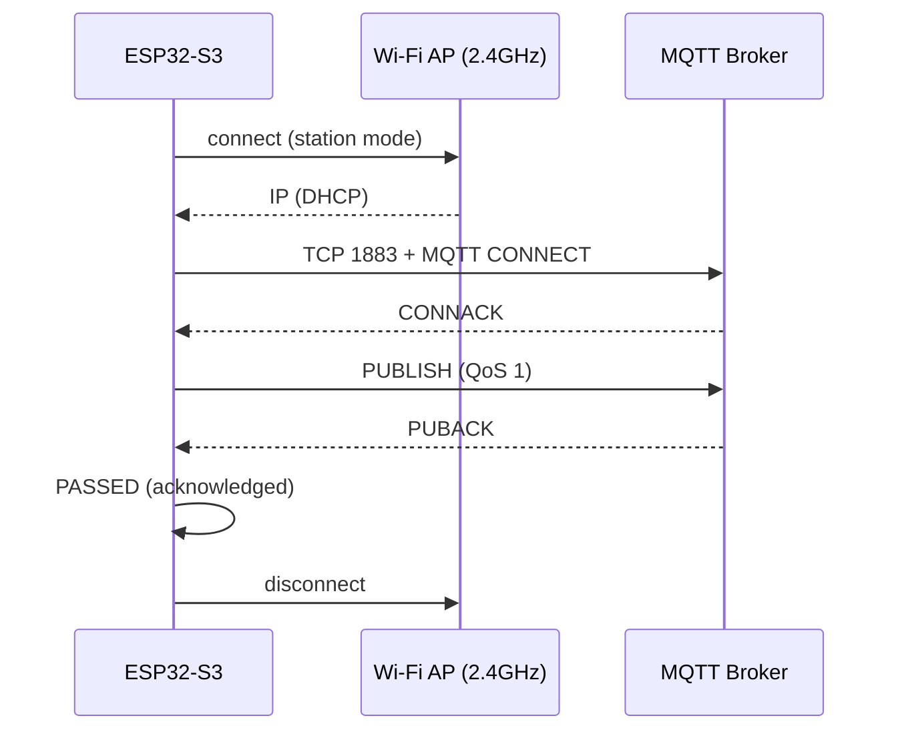

# mqtt-pub — 實作與測試指南

> M5Stack CoreS3 Diagnostic System · 診斷結果 MQTT 發布功能 · v1.0

## 1. 功能概覽

`mqtt-pub` 把診斷結果（測試記錄 + 錯誤上下文 + 系統資訊）組合成 JSON 報告，
透過 MQTT **QoS 1** 發布到 broker。Wi-Fi 連線由指令內部自動處理，
發布完成後立即拆除連線（不佔用無線資源）。



| 特性 | 值 |
|------|-----|
| QoS | **1**（broker PUBACK 才算 PASSED） |
| Payload | JSON 診斷報告 |
| 憑證 | NVS 持久化（`wifi-set`），NVS 優先於 menuconfig |
| 傳輸 | TCP only（無 TLS，flash budget） |

## 2. 實作架構

### 2.1 模組分工

| 模組 | 層級 | 職責 |
|------|------|------|
| `src/main.c` | Composition Root | `cmd_mqtt_pub` 指令：解析參數 → 連 Wi-Fi → 呼叫服務層 → 拆除連線 |
| `src/diag_net.c` | Interface Adapter（服務） | `diag_net_publish_mqtt()`：JSON 組裝 + MQTT 客戶端生命週期 + 同步等待 |
| `src/hal/hal_wifi.c` | Board Adapter（HAL） | station 連線/斷線/狀態；NVS 憑證（`diag_wifi` namespace） |
| `include/diag_net.h` | 介面 | 服務 API 宣告 |

### 2.2 發布流程（diag_net_publish_mqtt）

```c
1.  malloc 16KB JSON buffer
2.  json_build_report() ──▶ 組裝報告（見 §2.3）
3.  決定 topic：指令參數指定，否則預設 "m5s3_diag/<mac>"
4.  建立 binary semaphore（s_mqtt_evt）
5.  esp_mqtt_client_init( broker.uri )
6.  註冊 mqtt_evt 事件處理器（MQTT task 執行）
7.  esp_mqtt_client_start()
8.  xSemaphoreTake ──▶ 等待 MQTT_EVENT_CONNECTED（10s 上限）
9.  esp_mqtt_client_publish(topic, json, len, qos=1, retain=0)
        └─▶ QoS 1 保證 msg_id > 0（QoS 0 回傳 0 無法判成功）
10. 輪詢 s_mqtt_published（MQTT_EVENT_PUBLISHED = broker PUBACK）
11. esp_mqtt_client_stop() + destroy() + 刪除 semaphore + free(json)
```

### 2.3 JSON 報告結構

```json
{
  "app": "m5s3_diag", "idf": "v6.0.2-…",
  "mac": "a4:cf:12:34:56:78",
  "wifi": {"ssid": "MyWiFi", "ip": "192.168.1.42", "rssi": -44, "channel": 11},
  "rtc": "2026-08-01 00:26:29",
  "tests":   [{"id": "wifi", "result": "PASSED", "elapsed_ms": 2763, "message": "…"}],
  "errors":  [{"component": "WIFI", "location": "MB/WIFI", "message": "…",
               "count": 1, "debug1": "…", "debug2": "…"}],
  "summary": {"total": 14, "passed": 12, "skipped": 1, "failed": 1}
}
```

### 2.4 關鍵設計決策

| 決策 | 原因 |
|------|------|
| **QoS 1** | QoS 0 發布成功時 `esp_mqtt_client_publish` 回傳 `msg_id = 0`，`0 > 0` 永遠為 false → 成功路徑是死碼，指令永遠顯示 FAILED。QoS 1 保證 `msg_id > 0`，且 `MQTT_EVENT_PUBLISHED` 是 broker 的 **PUBACK**（真實確認），符合 DFS 規格「需 broker 確認才算 PASSED」 |
| **事件旗標 + semaphore** | MQTT 事件在 MQTT task 執行，指令在主 task 執行。共享旗標宣告為 `volatile` 避免跨 task 快取；semaphore 用於「等 CONNECTED」，輪詢用於「等 PUBLISHED」（PUBLISHED 事件可能伴隨其他事件，輪詢比對更穩健） |
| **16KB 暫態 buffer** | `snprintf` + `json_escape()`（無 JSON library 依賴）。所有字串欄位（SSID、component、location、test name、message）都先 escape，防注入。用完立即 free |
| **NVS 優先於 Kconfig** | `wifi-set mqtt mqtt://…` 寫入 NVS `diag_wifi` namespace；未設定時回退 `CONFIG_WIFI_DIAG_MQTT_URL` menuconfig 預設。執行時改設定不需重新編譯 |

## 3. 測試方法（端到端 SOP）

### 3.1 前置準備

- **設備端**：已燒錄韌體、已設定 Wi-Fi 憑證（見 §3.2 step 1–2）。
- **主機端**：Python 3 + paho-mqtt（安裝：`pip install --user paho-mqtt`）。
- **Broker**：公用測試 broker `broker.emqx.io:1883`（無需帳號）。生產環境可換成自家 broker。

### 3.2 步驟

**Step 1 — 設定 Wi-Fi 憑證（設備端，一次性）**

```
wifi-set ssid "你的SSID"            # 含空格需引號
wifi-set pass "你的密碼"
wifi-set mqtt mqtt://broker.emqx.io:1883
```

> NVS 持久化 — 重開機後仍有效。

**Step 2 — 驗證連線（可選）**

```
wifi connect         → Connected: IP 192.168.1.42, RSSI -44 dBm, ch 11
wifi ping google.com → Ping google.com: 5/5 replies, RTT 68/153/322 ms
```

**Step 3 — 主機端啟動訂閱（終端機 A）**

```bash
python3 -c "
import paho.mqtt.client as mqtt
def on_message(c, u, m):
    print('TOPIC:', m.topic)
    print(m.payload.decode())
c = mqtt.Client(mqtt.CallbackAPIVersion.VERSION2)
c.on_message = on_message
c.connect('broker.emqx.io', 1883, 30)
c.subscribe('diagtest/#')          # ← 與 step 4 的 topic 一致
c.loop_forever()"
```

> ⚠️ **訂閱要先啟動** — 訂閱建立完成前發布的訊息不會補送（無 retain）。

**Step 4 — 設備端發布（終端機 B）**

```
mqtt-pub diagtest
```

指令內部流程：連 Wi-Fi（15s 上限）→ 連 broker → 發布 JSON（QoS 1）→ 等 PUBACK → 斷線。

```
MQTT: connecting to 'MyWiFi'...
MQTT publish: PASSED (acknowledged)
```

> ✅ `PASSED (acknowledged)` = broker 已回 PUBACK。

**Step 5 — 主機端確認收到 JSON**

```
TOPIC: diagtest
{"app": "m5s3_diag", "idf": "v6.0.2-…", "mac": "a4:cf:12:34:56:78",
 "wifi": {"ssid": "MyWiFi", "ip": "192.168.1.42", "rssi": -44, "channel": 11},
 "rtc": "2026-08-01 00:26:29",
 "tests": […], "errors": […],
 "summary": {"total": 14, "passed": 12, "skipped": 1, "failed": 1}}
```

### 3.3 驗證結果判定

| 觀察點 | 預期 | 意義 |
|--------|------|------|
| 設備端輸出 | ✅ `MQTT publish: PASSED (acknowledged)` | broker 收到並回 PUBACK（QoS 1） |
| 主機端訂閱 | ✅ 收到 JSON、topic 正確、JSON 可 parse | 端到端發布成功，payload 結構完整 |
| `summary` | ✅ total/passed/skipped/failed 數字正確 | 診斷結果收集正確 |
| 設備端輸出 | ❌ `MQTT publish: FAILED (no ack)` | broker 不可達 / PUBACK 逾時（10s）→ 檢查 broker 位址 |
| 設備端輸出 | ⚠️ `MQTT publish failed: no broker` | 未設定 `wifi-set mqtt` → 先設定 |

## 4. 排錯指南

### 4.1 訂閱收不到訊息

| 可能原因 | 解法 |
|----------|------|
| **時序問題**：設備 publish 比訂閱建立早 | 先啟動訂閱、看到連線成功後再執行 `mqtt-pub`。或用自訂 topic（`mqtt-pub diagtest`）與訂閱端明確對齊 |
| **Topic 不匹配**：預設 topic 是 `m5s3_diag/<mac>` | 訂閱 `m5s3_diag/#` 或直接用 `mqtt-pub 自訂topic` 指定 |
| **Broker 風控**：公用 broker 短時間大量連線 | 改用自家 broker，或等 30 秒重試 |
| **設備端其實失敗** | 看設備端是否顯示 `FAILED (no ack)` |

### 4.2 設備端 FAILED (no ack)

| 可能原因 | 解法 |
|----------|------|
| Wi-Fi 連不上 | 先 `wifi connect` 確認；看 reason code（auth 失敗 = 密碼錯） |
| Broker 不可達 | `wifi ping <broker-ip>` 驗證網路；確認 port 1883 開放 |
| Broker URI 格式錯 | 必須 `mqtt://host:1883`（無 TLS，`mqtts://` 不支援） |

### 4.3 主機端 paho 錯誤

| 現象 | 解法 |
|------|------|
| `ModuleNotFoundError: paho` | `pip install --user --break-system-packages paho-mqtt` |
| `DeprecationWarning: Callback API version 1` | 用 `mqtt.Client(mqtt.CallbackAPIVersion.VERSION2)`（不影響功能） |

## 5. 相關指令速查

| 指令 | 說明 |
|------|------|
| `wifi-set mqtt mqtt://host:1883` | 設定 broker（NVS 持久化） |
| `wifi-set clear` | 清除所有 NVS 覆蓋（回退 Kconfig） |
| `mqtt-pub [topic]` | 發布診斷報告（預設 topic `m5s3_diag/<mac>`） |
| `upload` | 同報告走 HTTP POST 到 `wifi-set url` 的端點 |
| `ntp-sync` | NTP 校時並寫入 BM8563 RTC |
| `wifi ping <host>` | ICMP 連通性測試（IP 或 hostname） |

---

原始碼：`src/diag_net.c` · `src/hal/hal_wifi.c` · `src/main.c`
規格：`doc/diag_function_spec.md` §MQTT Publish Utility
